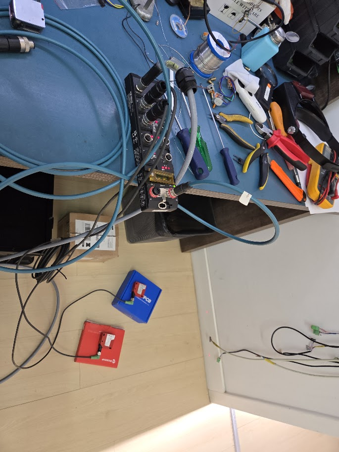
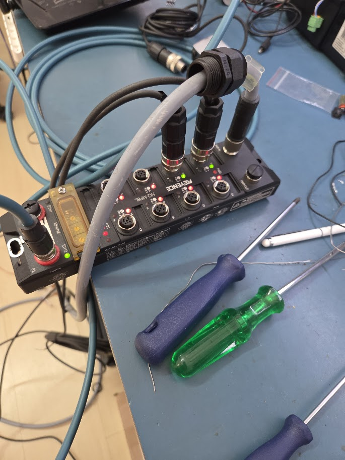
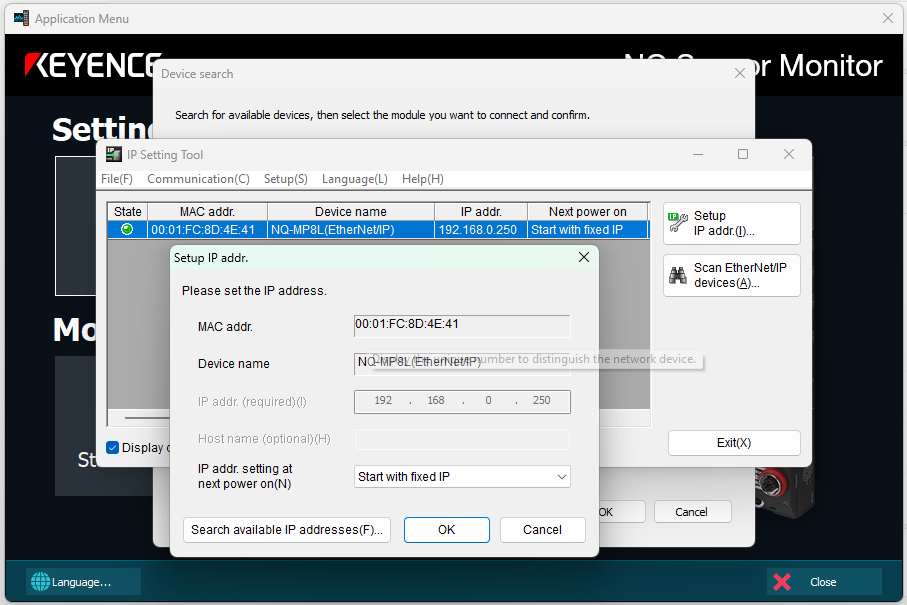
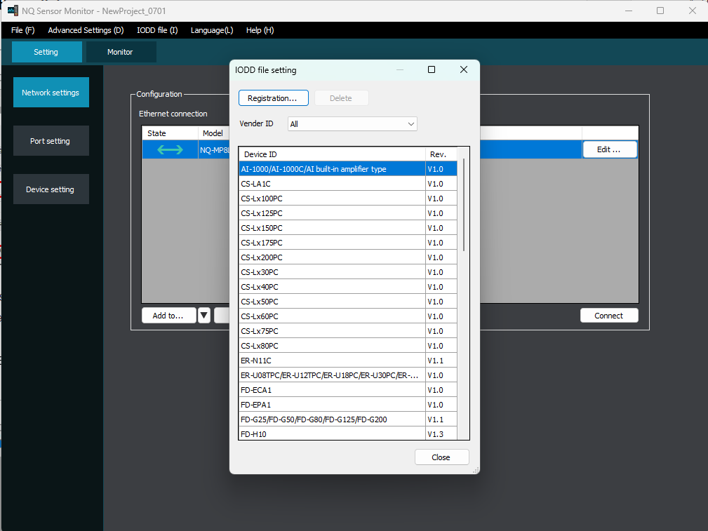
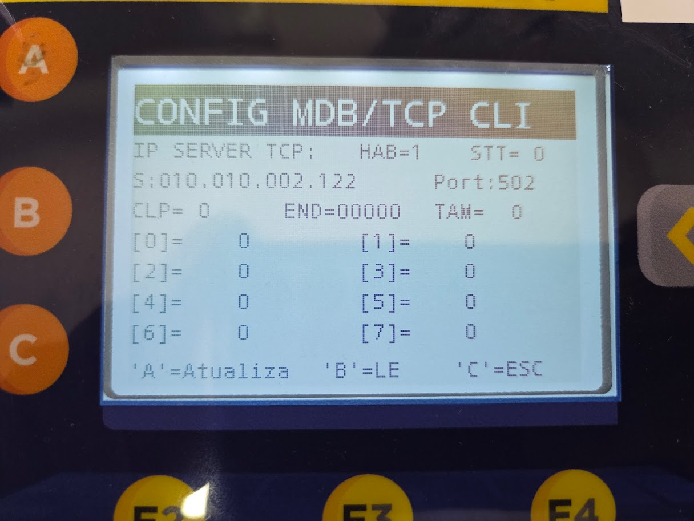
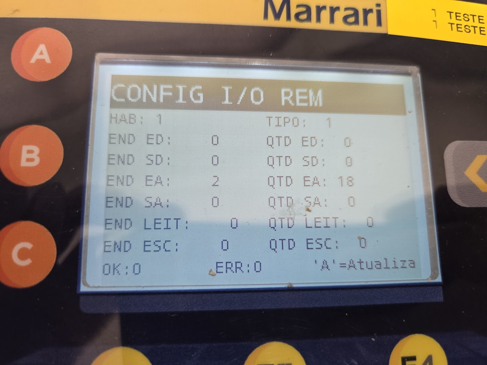

# Integração do sensor Leuze ODS9L2 via IO-Link e Modbus TCP

## Objetivo

Documentar a configuração do sensor de distância **Leuze ODS9L2** conectado ao mestre IO-Link **Keyence NQ-MP8L**, com comunicação Modbus TCP com o **CP300**.

## Componentes e recursos

- Sensor de distância Leuze ODS9L2;
- mestre IO-Link/Modbus TCP Keyence NQ-MP8L;
- CP300;
- software Keyence NQ Series Monitor;
- arquivo IODD do sensor Leuze;
- arquivo de configuração do NQ-MP8L.

> O NQ Series Monitor deve ser baixado no site da Keyence. O download requer conta e autenticação. Os manuais dos equipamentos estão disponíveis na ajuda do próprio software.

## Visão geral da montagem e conexões

A montagem de bancada utilizada nos testes reúne o mestre IO-Link Keyence NQ-MP8L, os sensores, a alimentação, a conexão Ethernet e o CP300.



A imagem abaixo mostra em detalhe as conexões dos sensores e os demais cabos ligados ao NQ-MP8L. Antes de energizar o conjunto, confira a identificação das portas, o aperto dos conectores e a alimentação prevista para cada componente.



## Configuração de rede do NQ-MP8L

### Endereço IP padrão

Com as três chaves rotativas na posição `000`, o endereço IP padrão do módulo é:

```text
192.168.0.250
```

O procedimento oficial para alterar o IP está descrito na página 4-6 do **NQ Series User's Manual** e utiliza:

- as três chaves rotativas do módulo;
- o botão Reset;
- o software NQ Series Monitor.

### Configuração de um IP em outra sub-rede

Durante os testes, o IP Setting Tool não permitiu alterar diretamente os três primeiros octetos de `192.168.0.250` sem o uso de um servidor DHCP. O procedimento abaixo foi utilizado como alternativa:

1. Posicione as chaves rotativas em `600`.
2. Pressione o botão Reset até os LEDs do módulo piscarem.
3. Conecte o cabo Ethernet a uma rede que possua servidor DHCP.
4. Aguarde o módulo receber um endereço dinâmico com a sub-rede definida pelo servidor.
5. No NQ Series Monitor, escolha **New** e localize o dispositivo.
6. Selecione o dispositivo e clique em **Start IP Setting Tool**.
7. Confirme o endereço atribuído pelo DHCP e selecione **Start with Fixed IP**.
8. Confirme a operação e feche o aplicativo.
9. Ajuste nas chaves rotativas o último octeto desejado para o IP fixo.
10. Reinicie o módulo pelo botão Reset.
11. Abra novamente o software e teste a conexão.

> Este procedimento registra uma solução validada durante os testes. As telas do manual consultado eram diferentes das exibidas pelo equipamento, possivelmente por diferença de versão do firmware.



## Cadastro do sensor por arquivo IODD

Para utilizar um sensor IO-Link que não seja fabricado pela Keyence, é necessário cadastrar seu arquivo IODD:

1. Baixe o arquivo IODD na página do fabricante do sensor.
2. No NQ Series Monitor, selecione **IODD file**.
3. Clique em **Registration**.
4. Localize e selecione o arquivo IODD correspondente.
5. Selecione o sensor cadastrado na lista de sensores.



## Configuração do CP300

Após configurar o NQ-MP8L na mesma rede do CP300:

1. Acesse a tela de configurações `F6` pressionando as teclas `A + OK`.
2. Escolha a opção `A` e navegue até a tela **CONFIG MDB/TCP CLI**.
3. Configure os seguintes parâmetros:

   | Parâmetro | Valor |
   |---|---:|
   | IP | Endereço do NQ-MP8L |
   | Porta | `502` |
   | CLP | `1` |
   | HAB | `1` |

4. Grave as alterações pressionando `A`.
5. Navegue até a tela **CONFIG I/O REM**.
6. Configure os seguintes parâmetros:

   | Parâmetro | Valor |
   |---|---:|
   | END EA | `2` |
   | QTD EA | `18` |
   | Tipo | `1` |
   | Hab | `1` |

7. Grave novamente as alterações pressionando `A`.
8. Desligue e ligue o CP300.
9. Confirme que as configurações foram mantidas.

### Variáveis de distância

Os valores medidos aparecem no bloco de variáveis configurado como entrada analógica:

| Porta do NQ-MP8L | Índice da entrada analógica |
|---|---:|
| C0 | `0` |
| C1 | `16` |

O programa de nível superior deve configurar e tratar essas variáveis conforme a aplicação.

### Telas de referência





## Endereços Modbus TCP do NQ-MP8L

Os endereços abaixo estão em decimal e consideram o endereço inicial igual a `1`:

| Porta | Endereço inicial |
|---|---:|
| C0 | `3` |
| C1 | `19` |
| C2 | `35` |
| C3 | `51` |
| C4 | `67` |
| C5 | `83` |
| C6 | `99` |
| C7 | `115` |

Cada porta ocupa um intervalo de 16 endereços.

## Arquivos de apoio

- [IODD do sensor Leuze ODS9L2 — SW_ODS9_2191-20220309-IODD1.1.zip](assets/leuze-ods9l2-io-link/arquivos/SW_ODS9_2191-20220309-IODD1.1.zip)
- [Configuração básica do NQ-MP8L — Config_NQ-MP8L_ODS9L2.nqd](assets/leuze-ods9l2-io-link/arquivos/Config_NQ-MP8L_ODS9L2.nqd)

### Organização local dos anexos

Os anexos estão armazenados localmente nas pastas abaixo, tornando esta documentação independente do Trello:

- [`assets/leuze-ods9l2-io-link/imagens`](assets/leuze-ods9l2-io-link/imagens/README.md): capturas de tela utilizadas no procedimento;
- [`assets/leuze-ods9l2-io-link/arquivos`](assets/leuze-ods9l2-io-link/arquivos/README.md): arquivo IODD e configuração do NQ-MP8L.

## Origem das informações

Conteúdo consolidado a partir dos comentários do cartão Trello **COMUNICAÇÃO COM IO-LINK MASTER KEYENCE SÉRIE NQ COM MODBUS-TCP**, escritos por Ricardo Toshiaki Yuaoca entre 30 de junho e 1º de julho de 2026.
