# Instalação do Ubuntu Server LTS

## Objetivo

Instalar o Ubuntu Server LTS em um computador x86-64 utilizando firmware UEFI.

## Requisitos

- Computador x86-64
- Pendrive de 8 GB ou superior
- Conexão com a Internet
- Computador com Windows para preparação da mídia

## Padrão adotado

Este procedimento foi validado utilizando as configurações apresentadas na tabela a seguir.

| Item | Valor adotado |
|------|---------------|
| Idioma do instalador | Português |
| Idioma do sistema | English |
| Layout do teclado | Portuguese (Brazil) |
| Variante do teclado | Portuguese (Brazil) |
| Configuração inicial da rede | DHCP |
| Configuração definitiva da rede | Netplan (IP definido posteriormente) |
| Tipo de instalação | Ubuntu Server |
| Armazenamento | Disco inteiro |
| LVM | Desabilitado |
| Criptografia (LUKS) | Desabilitada |
| Usuário administrador | hr1500 |
| Diretório da aplicação | /opt/hr1500 |
| Serviço do sistema | hr1500.service |

## Download da imagem

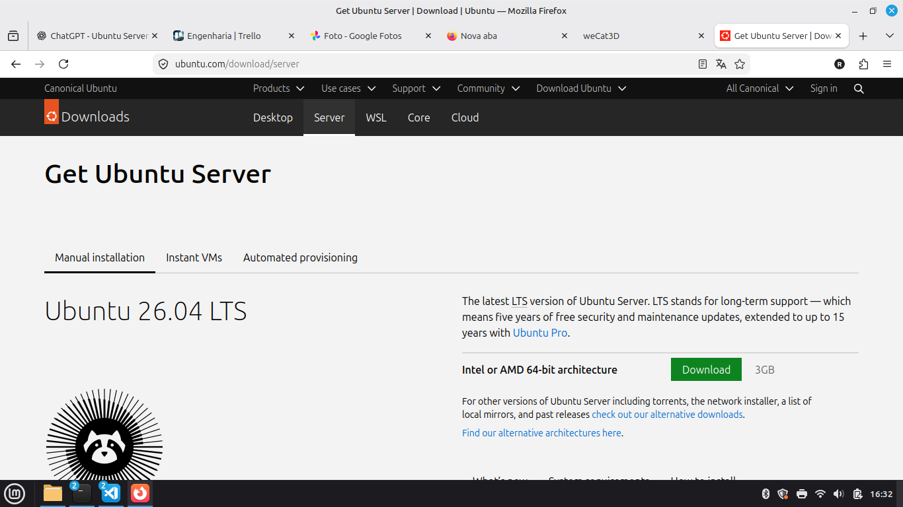

Faça o download da versão mais recente do Ubuntu Server LTS no site oficial.

Arquivo:

- ubuntu-26.04-live-server-amd64.iso

Após o download, verifique se o arquivo foi concluído corretamente antes de iniciar a gravação do pendrive.

## Preparação da mídia de instalação

1. Conecte um pendrive com capacidade mínima de 8 GB.

2. Execute o Rufus.

3. Em **Dispositivo**, selecione o pendrive.

4. Em **Seleção de Boot**, clique em **Selecionar** e escolha o arquivo ISO do Ubuntu Server.

5. Mantenha as demais opções nos valores padrão.

6. Clique em **Iniciar**.

7. Aguarde a conclusão da gravação e remova o pendrive com segurança.

## Configuração da BIOS/UEFI

Antes de iniciar a instalação, verifique as configurações da BIOS/UEFI do computador.

### Modo de Boot

Configure o sistema para inicializar em modo **UEFI**.

Não utilize o modo Legacy/CSM, exceto quando houver necessidade de compatibilidade com hardware antigo.

### Secure Boot

O Ubuntu Server LTS é compatível com Secure Boot.

Caso sejam utilizados drivers ou módulos de terceiros, poderá ser necessário desabilitar essa opção.

### Ordem de Boot

Configure o pendrive como primeiro dispositivo de inicialização ou utilize o menu de seleção de boot da BIOS.

Após a conclusão da instalação, restaure o SSD como primeiro dispositivo de inicialização.

### Data e Hora

Verifique se a data e a hora do sistema estão corretas.

### Configuração SATA

Utilize o modo **AHCI**.

Evite utilizar modos RAID ou Intel RST, salvo quando houver necessidade específica do equipamento.

### Virtualização

A tecnologia Intel VT-x ou AMD-V pode permanecer habilitada.

### Salvar alterações

Salve as configurações e reinicie o computador utilizando o pendrive de instalação.

### Recomendações

- Desabilite o boot pela rede (PXE), caso não seja utilizado.
- Configure o SSD como primeiro dispositivo de boot após a instalação.
- Habilite o recurso "Restore on AC Power Loss", quando disponível, para que o equipamento reinicie automaticamente após o retorno da energia elétrica.

## Inicialização pelo pendrive

1. Conecte o pendrive ao computador.

2. Ligue o computador.

3. Acesse o **Boot Menu** da BIOS/UEFI.

4. Sempre que houver duas opções de inicialização para o pendrive, selecione a opção identificada como UEFI.

   Exemplo:

   - `UEFI: USB: USB: Part 0 : OS Bootloader`

5. Não selecione a opção de inicialização Legacy, normalmente apresentada apenas como:

   - `USB: USB: Part 0 : Boot Drive`

6. Aguarde o carregamento do instalador do Ubuntu Server LTS.

## Inicialização do instalador

Após selecionar o pendrive no Boot Menu, o carregador de inicialização (GNU GRUB) será apresentado.

Selecione a opção **Try or Install Ubuntu Server** e pressione **Enter** para iniciar o instalador.

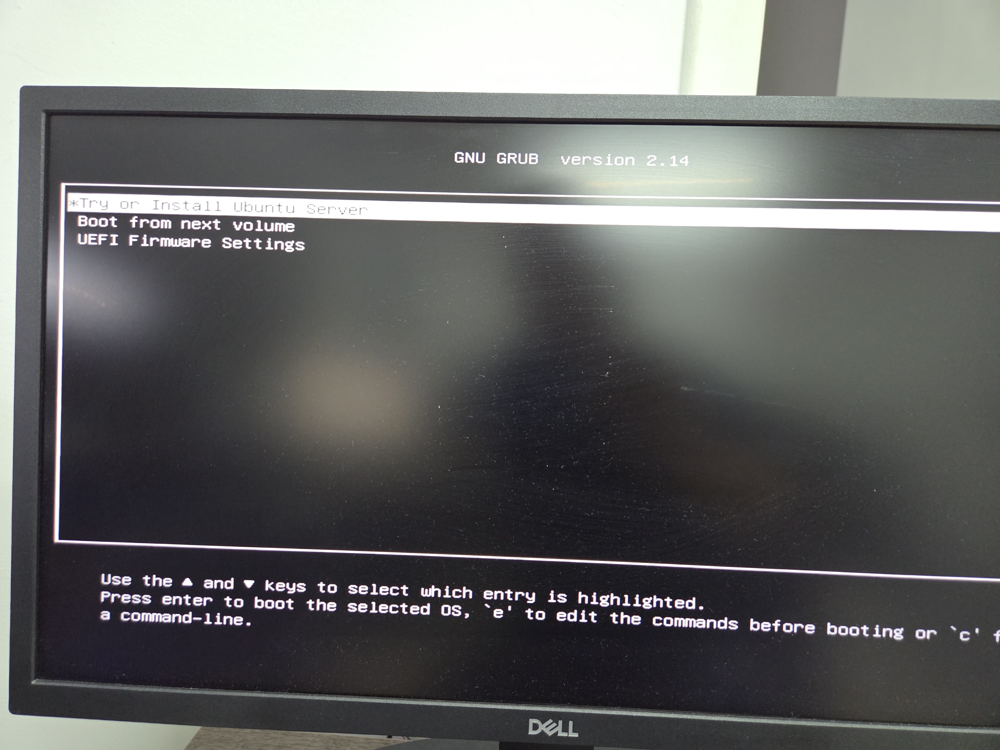

*Figura 2 – Menu inicial do instalador do Ubuntu Server.*

## Seleção do idioma

Selecione **Português** como idioma do instalador e pressione **Enter** para prosseguir.

O idioma utilizado durante a instalação não define o idioma do sistema operacional, que será configurado posteriormente.

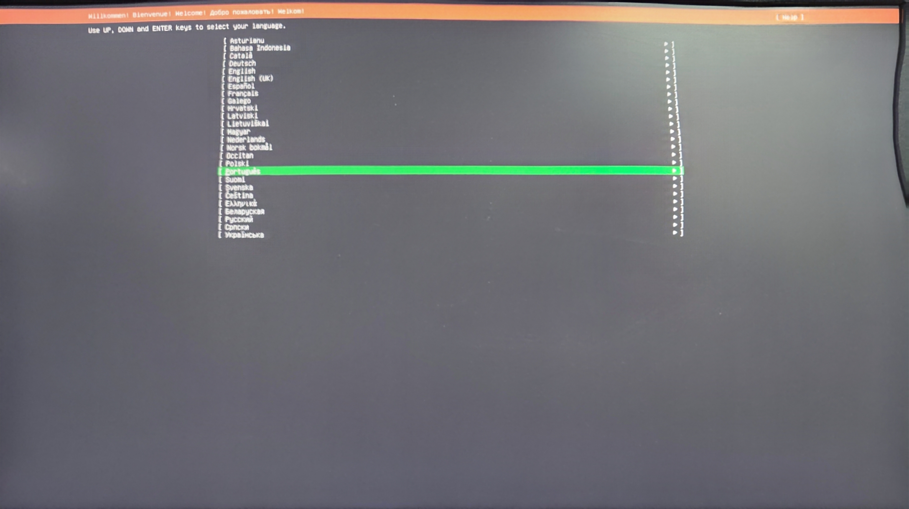

*Figura 3 – Seleção do idioma do instalador.*

## Configuração do teclado

Para teclados padrão brasileiros (ABNT2), configure:

- Layout: Portuguese (Brazil)
- Variant: Portuguese (Brazil)

Não utilize a opção **Identify keyboard**.

Selecione **Concluído** e pressione **Enter**.

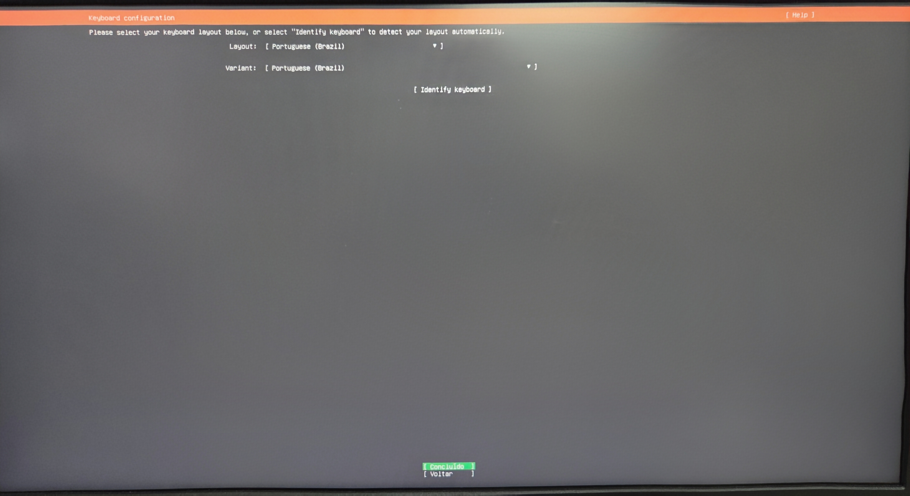

*Figura 4 – Configuração do layout do teclado.*

## Seleção da base de instalação

Selecione a opção **Ubuntu Server**.

A opção **Ubuntu Server (minimized)** instala um sistema com um conjunto reduzido de pacotes. Para esta aplicação recomenda-se utilizar a instalação padrão (**Ubuntu Server**).

Mantenha desmarcada a opção **Search for third-party drivers**.

Em seguida, selecione **Concluído** e pressione **Enter**.

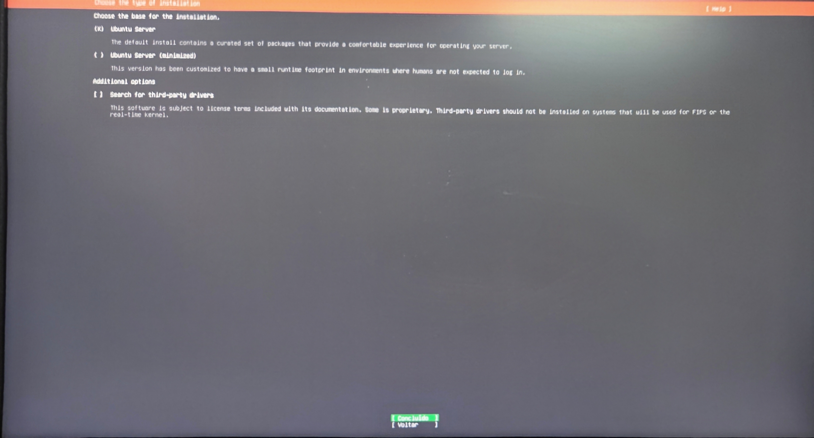

*Figura 5 – Seleção da base de instalação do Ubuntu Server.*

## Configuração da rede

O instalador detecta automaticamente as interfaces de rede disponíveis.

Neste procedimento, a interface Ethernet foi configurada para obter um endereço IP automaticamente (DHCP).

> Neste procedimento a interface de rede é configurada via DHCP apenas durante a instalação. A configuração definitiva da rede será realizada posteriormente utilizando o Netplan.

Caso a interface ainda não esteja configurada para DHCP:

1. Selecione a interface Ethernet.
2. Pressione **Enter**.
3. Em **IPv4 Method**, selecione **Automatic (DHCP)**.
4. Retorne à tela anterior.

Após verificar a configuração da interface, selecione **Concluído** e pressione **Enter**.

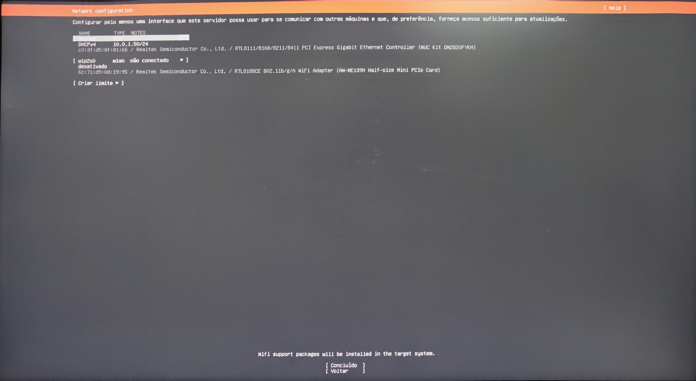

*Figura 6 – Configuração da interface de rede.*

## Configuração do proxy

Caso a rede utilize um servidor proxy para acesso à Internet, informe o endereço do proxy.

Na maioria das instalações, esse campo deve permanecer em branco.

Selecione **Concluído** e pressione **Enter**.

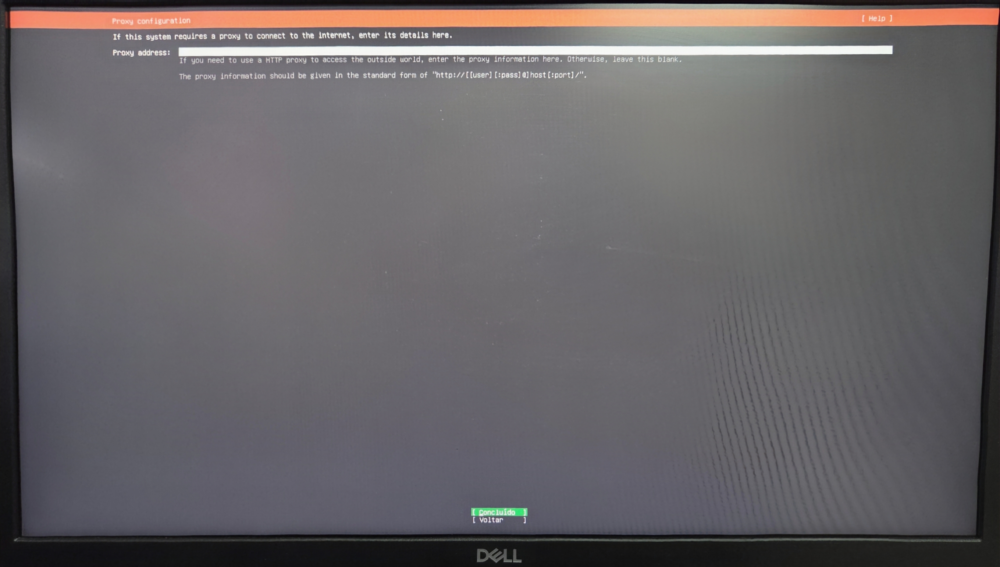

*Figura 7 – Configuração do servidor proxy.*

## Configuração do repositório de pacotes

O instalador utiliza um repositório (mirror) para obter os pacotes de instalação e futuras atualizações.

Mantenha o endereço padrão apresentado pelo instalador.

Após a validação do repositório, selecione **Concluído** e pressione **Enter**.

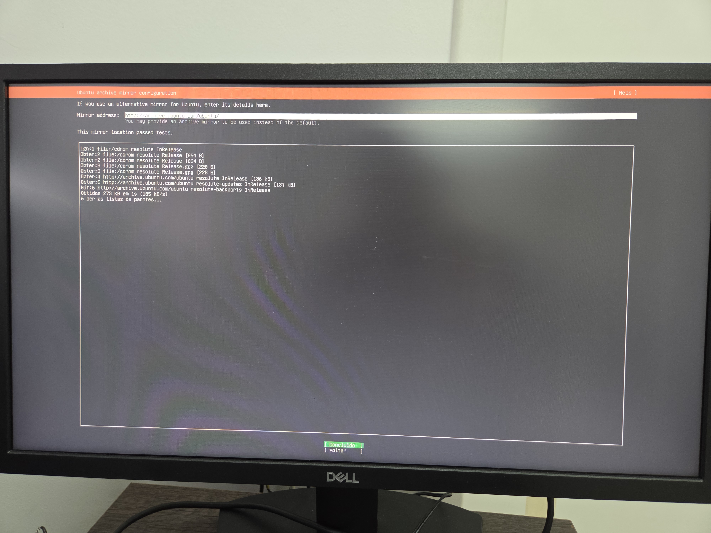

*Figura 8 – Configuração do repositório de pacotes.*

## Configuração do armazenamento

Selecione **Use an entire disk**.

Selecione o SSD onde o Ubuntu será instalado.

Desmarque a opção **Set up this disk as an LVM group**.

Mantenha desabilitadas as opções de criptografia (**LUKS**) e de criação de chave de recuperação.

Selecione **Concluído** e pressione **Enter**.

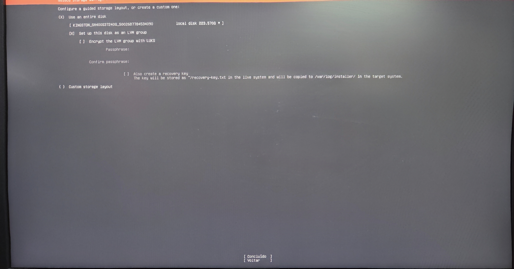

*Figura 9 – Configuração do armazenamento.*

Este procedimento utiliza um único SSD dedicado ao sistema operacional e à aplicação HR1500. Por esse motivo, não é utilizada a configuração LVM.

## Resumo do particionamento

Verifique o particionamento que será criado no SSD.

Para este procedimento serão criadas automaticamente duas partições:

- `/boot/efi`
- `/`

Estando a configuração correta, selecione **Concluído** e pressione **Enter**.

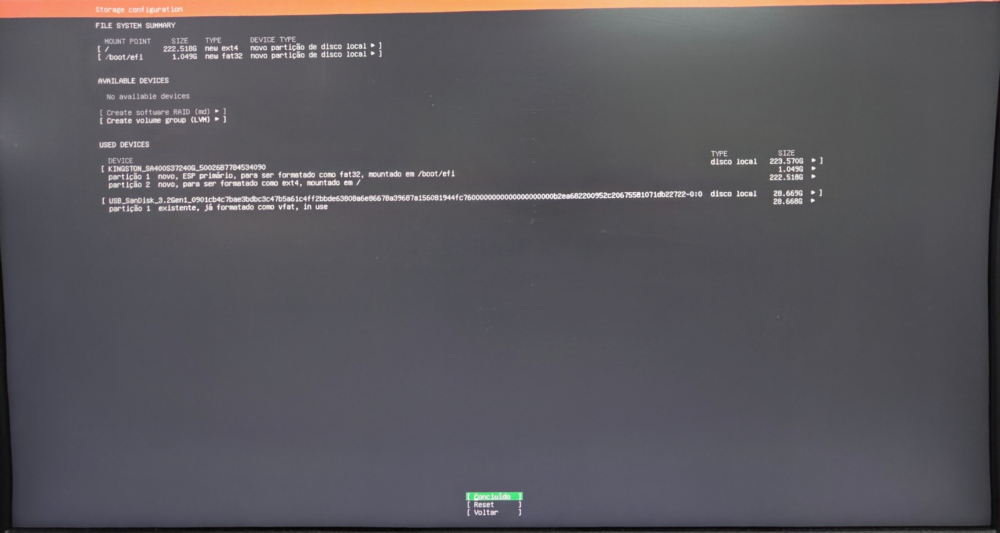

*Figura 10 – Resumo do particionamento do disco.*

## Configuração do perfil

Preencha os campos conforme a tabela abaixo.

| Campo | Valor |
|-------|-------|
| **O seu nome** | `HR1500` |
| **Nome do servidor** | `hr1500-server` |
| **Nome do utilizador** | `hr1500` |
| **Palavra-passe** | `mar4321` |
| **Confirmar palavra-passe** | `mar4321` |

Após preencher todos os campos, selecione **Concluído** e pressione **Enter**.

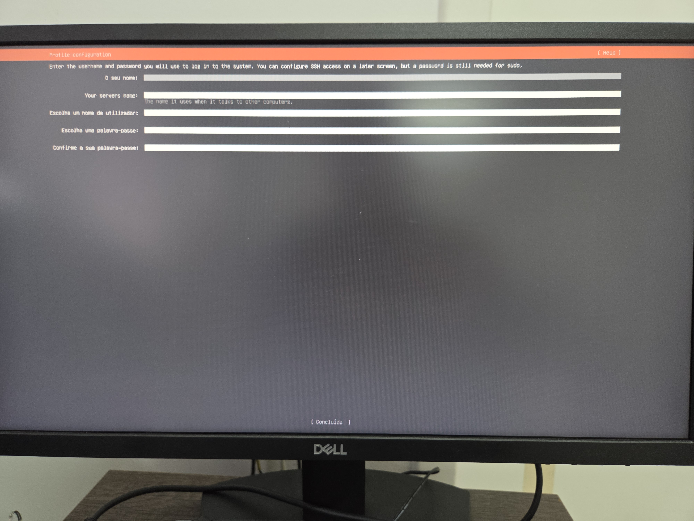

*Figura 11 – Configuração do perfil do sistema.*

> **Nota:** A senha `mar4321` é utilizada como senha padrão de fábrica. Recomenda-se alterá-la durante o comissionamento do equipamento ou antes da entrega ao cliente.

## Ubuntu Pro

Mantenha selecionada a opção **Skip for now**.

Selecione **Continue** e pressione **Enter**.

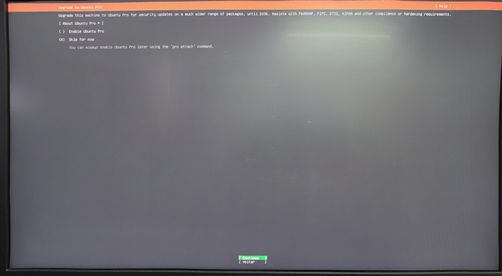

*Figura 12 – Configuração do Ubuntu Pro.*

## Configuração do SSH

Habilite a instalação do servidor OpenSSH.

Mantenha habilitada a opção **Allow password authentication over SSH**.

Não utilize a opção **Import SSH key**.

Selecione **Concluído** e pressione **Enter**.

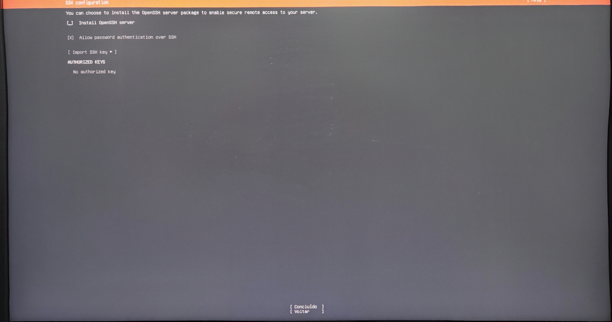

*Figura 13 – Configuração do acesso remoto via SSH.*

## Seleção de pacotes adicionais

Não selecione nenhum pacote adicional.

Selecione **Concluído** e pressione **Enter**.

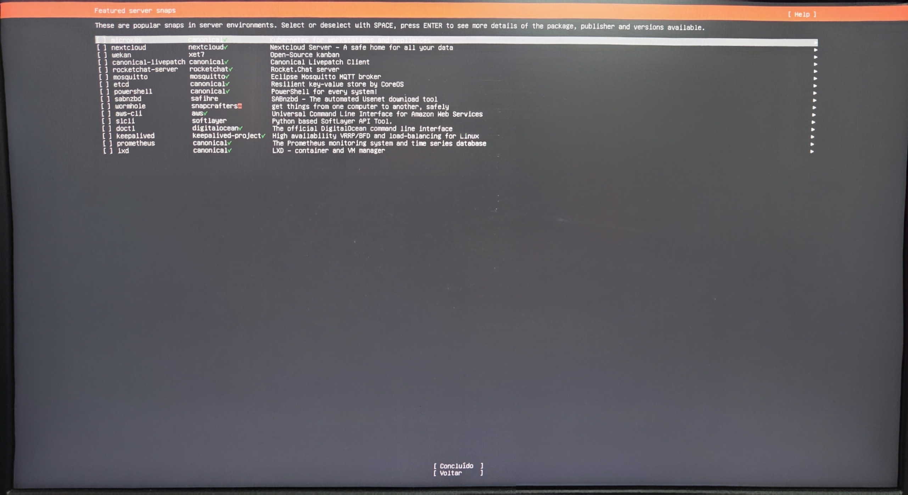

*Figura 14 – Seleção de pacotes adicionais (Server Snaps).*

## Conclusão da instalação

Ao término da instalação, o Ubuntu Server solicitará a reinicialização do computador.

Selecione **Reboot Now** e pressione **Enter**.

Remova o pendrive de instalação quando solicitado.

O sistema será reinicializado e iniciará o Ubuntu Server a partir do SSD.

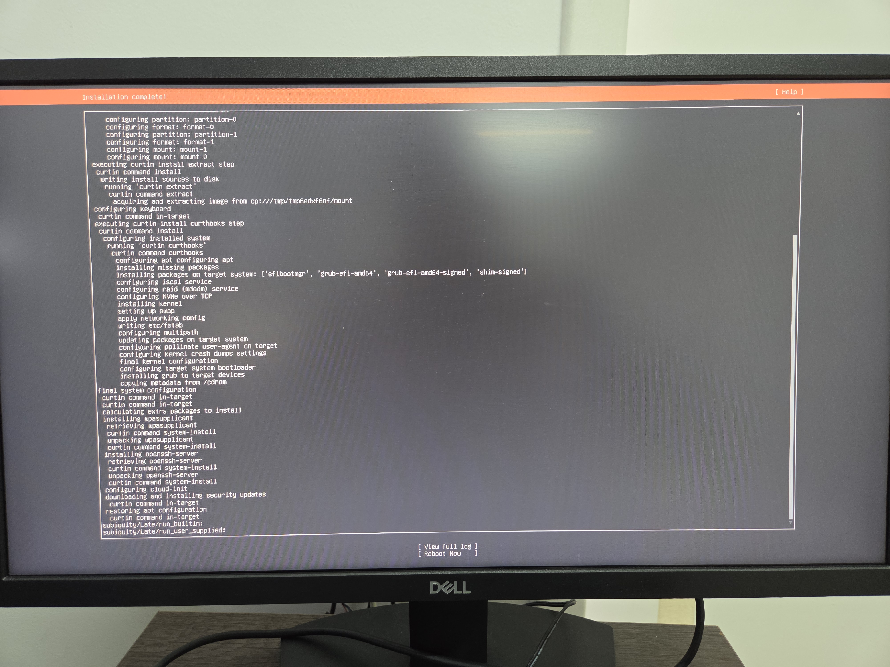

*Figura 15 – Conclusão da instalação.*

## Primeiro boot

Após a reinicialização, aguarde a inicialização do sistema operacional.

Será apresentada a tela de login do Ubuntu Server.

Utilize as credenciais definidas na seção **1.17 Configuração do perfil** para acessar o sistema.

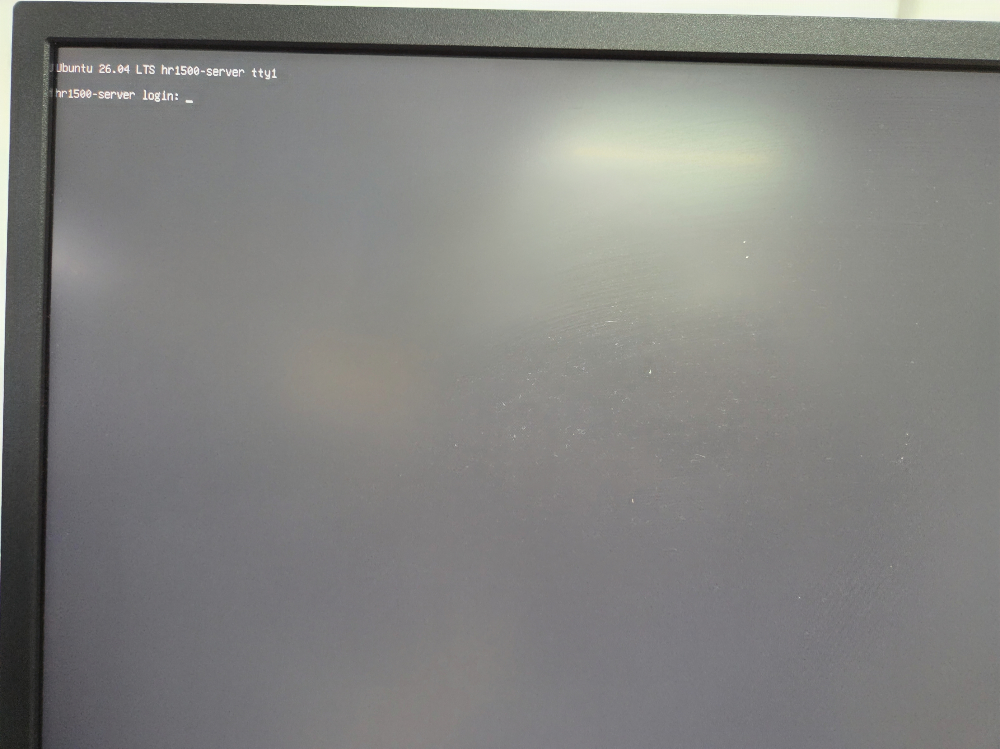

*Figura 16 – Tela de login do Ubuntu Server.*


# Preparação do Sistema Operacional

Este capítulo descreve as configurações iniciais que devem ser realizadas após a instalação do Ubuntu Server LTS.

Ao final deste procedimento, o sistema estará preparado para a instalação da aplicação HR1500.

## Primeiro acesso

Após a inicialização do sistema, informe as credenciais de acesso:

| Campo | Valor |
|-------|-------|
| Utilizador | `hr1500` |
| Palavra-passe | `mar4321` |

Após o login, será apresentado o prompt do Ubuntu Server.

## Verificação da versão do Ubuntu

Verifique a versão instalada do Ubuntu executando o comando:

```bash
lsb_release -a
```

O resultado deve indicar a versão do Ubuntu Server LTS utilizada neste procedimento.

## Atualização do sistema

Atualize a lista de pacotes disponíveis:

```bash
sudo apt update
```

Em seguida, instale as atualizações disponíveis:

```bash
sudo apt upgrade -y
```

Após a conclusão da atualização, prossiga para a próxima etapa.

## Configuração do GRUB

Em alguns computadores industriais utilizados no HR1500, o Ubuntu Server pode interromper a inicialização quando nenhum monitor está conectado, apresentando a mensagem:

```text
error: no suitable video mode found
```

Para evitar esse problema, configure o GRUB para operar exclusivamente em modo texto.

### Abrir o arquivo de configuração

Execute o comando:

```bash
sudo nano /etc/default/grub
```

Informe a senha do utilizador `hr1500` quando solicitado.

O editor de texto **Nano** será aberto.

---

### Localizar as configurações

Verifique se as seguintes linhas existem no arquivo:

```text
GRUB_TERMINAL=
GRUB_GFXMODE=
GRUB_GFXPAYLOAD_LINUX=
GRUB_TERMINAL_OUTPUT=
```

Caso alguma delas não exista, adicione-a ao final do arquivo.

---

### Alterar as configurações

Configure os parâmetros conforme mostrado abaixo:

```text
GRUB_TERMINAL=console
GRUB_GFXMODE=text
GRUB_GFXPAYLOAD_LINUX=text
```

Se existir a linha:

```text
GRUB_TERMINAL_OUTPUT=gfxterm
```

substitua por:

```text
GRUB_TERMINAL_OUTPUT=console
```

Após a alteração, o arquivo deverá conter as seguintes configurações:

```text
GRUB_TERMINAL=console
GRUB_GFXMODE=text
GRUB_GFXPAYLOAD_LINUX=text
GRUB_TERMINAL_OUTPUT=console
```

---

### Salvar o arquivo

Após concluir as alterações:

1. Pressione **Ctrl + O** (letra O).
2. O Nano exibirá o nome do arquivo que será gravado.
3. Pressione **Enter** para confirmar.

---

### Fechar o Nano

Pressione:

```text
Ctrl + X
```

para retornar ao terminal.

---

### Atualizar o GRUB

Execute o comando:

```bash
sudo update-grub
```

Resultado esperado:

```text
Generating grub configuration file ...
Done
```

---

### Reiniciar o computador

Execute:

```bash
sudo reboot
```

Após a reinicialização, confirme que o Ubuntu Server inicializa normalmente, mesmo sem monitor conectado.

Importante: Esta configuração foi validada no PC industrial utilizado pelo HR1500 e deve ser considerada obrigatória para equipamentos que operam sem monitor e teclado conectados (modo headless).

## Verificação do serviço SSH

O servidor OpenSSH permite acessar o equipamento remotamente através da rede.

Após a instalação do Ubuntu, confirme se o serviço foi iniciado corretamente.

Execute o comando:

```bash
systemctl status ssh
```

Resultado esperado:

```text
ssh.service - OpenBSD Secure Shell server
     Loaded: loaded (...)
     Active: active (running)
```

Pressione a tecla **Q** para sair da tela de visualização e retornar ao terminal.

## Teste do SSH

Verifique o endereço IP recebido pelo computador.

Execute:

```bash
ip addr
```

Localize a interface Ethernet utilizada durante a instalação.

Exemplo:

```text
2: enp3s0:
    inet 192.168.1.105/24
```

Anote o endereço IP.

Utilizando outro computador conectado à mesma rede, execute:

```text
ssh hr1500@192.168.1.105
```
Caso o computador seja Windows, abrir o PowerShell. Se for Linux, abrir o terminal

Informe a senha:

```text
mar4321
```

Se o acesso ocorrer normalmente, o serviço SSH está funcionando corretamente.

Na primeira conexão, será exibida uma mensagem semelhante a:

```text
Are you sure you want to continue connecting (yes/no/[fingerprint])?
```

Digite:

```text
yes
```

e pressione **Enter**.

Esta confirmação será solicitada apenas no primeiro acesso.

## Configuração da rede

O PC industrial do HR1500 possui quatro interfaces Ethernet.

A configuração padrão de fábrica é apresentada na tabela abaixo.

| Interface | Utilização | Configuração |
|-----------|------------|--------------|
| LAN1 | Rede da máquina | DHCP |
| LAN2 | Scanner Wenglor | 192.168.10.78/24 |
| LAN3 | Porta de serviço | 192.168.20.1/24 |
| LAN4 | Reserva | Sem endereço IP |

### Identificar as interfaces de rede

O PC industrial utilizado no HR1500 possui quatro interfaces Ethernet.

Execute o comando:

```bash
ip link
```

Será apresentada uma lista semelhante à abaixo:

```text
1: lo:
2: enp1s0:
3: enp2s0:
4: enp3s0:
5: enp4s0:
```

Os nomes das interfaces poderão variar conforme o hardware utilizado.

Identifique a interface destinada à comunicação com a rede da máquina e a interface destinada ao scanner Wenglor.

### Localizar o arquivo de configuração

Execute o comando:

```bash
ls /etc/netplan
```

Normalmente será apresentado um arquivo semelhante a:

```text
50-cloud-init.yaml
```

ou

```text
00-installer-config.yaml
```

Anote o nome do arquivo.

Verifique se existem outros arquivos com extensão `.yaml` no diretório:

```bash
find /etc/netplan -maxdepth 1 -type f -name '*.yaml' -print
```

O Netplan processa todos os arquivos `.yaml` encontrados nesse diretório. Não mantenha cópias como `backup.yaml`, pois suas configurações também serão aplicadas e poderão criar endereços ou rotas duplicadas. Renomeie eventuais cópias utilizando uma extensão diferente, por exemplo:

```bash
sudo mv /etc/netplan/backup.yaml /etc/netplan/backup.yaml.bak
```

### Editar a configuração da rede

> **Importante:** O arquivo de configuração do Netplan utiliza o formato YAML, que é sensível à indentação. Mantenha exatamente a mesma quantidade de espaços apresentada no exemplo. Não utilize tabulações (TAB); utilize apenas espaços.

Antes de alterar a configuração, verifique o tempo de inicialização atual:

```bash
systemd-analyze
```

Em seguida, identifique os serviços que mais contribuíram para esse tempo:

```bash
systemd-analyze blame
```

Quando uma interface sem conexão for considerada obrigatória, poderá ser apresentada uma espera semelhante a:

```text
2min systemd-networkd-wait-online.service
```

Anote o tempo total de inicialização para compará-lo após a alteração.

Abra o arquivo de configuração utilizando o editor Nano.

Exemplo:

```bash
sudo nano /etc/netplan/00-installer-config.yaml
```

Substitua o conteúdo do arquivo pelo exemplo abaixo.

```yaml
network:
  version: 2
  renderer: networkd

  ethernets:

    enp1s0:
      dhcp4: true
      dhcp6: true
      optional: true

    enp2s0:
      dhcp4: false
      addresses:
        - 192.168.10.78/24

    enp3s0:
      dhcp4: false
      addresses:
        - 192.168.20.1/24
      optional: true

    enp4s0:
      dhcp4: false
      optional: true
```

Importante: Os nomes das interfaces podem variar conforme o hardware. Confirme os nomes utilizando o comando `ip link` antes de salvar o arquivo.

A opção `optional: true` deve ser utilizada nas interfaces que não são necessárias para iniciar a aplicação:

- LAN1, que pode estar desconectada ou sem servidor DHCP;
- LAN3, utilizada somente durante a manutenção;
- LAN4, mantida como porta reserva.

Não adicione essa opção à LAN2. A interface do scanner deve permanecer obrigatória para que o sistema aguarde sua configuração durante a inicialização.

### Salvar o arquivo

Após concluir a edição:

1. Pressione **Ctrl + O**.
2. Pressione **Enter**.
3. Pressione **Ctrl + X** para retornar ao terminal.

### Verificar a sintaxe

Antes de aplicar a configuração, execute:

```bash
sudo netplan generate
```

Se nenhuma mensagem de erro for apresentada, a sintaxe do arquivo está correta.

Caso seja apresentada uma mensagem de erro, verifique a linha indicada. Na maioria dos casos, o problema está relacionado à indentação do arquivo YAML.

### Aplicar a configuração

Execute o comando:

```bash
sudo netplan apply
```

Caso nenhuma mensagem seja apresentada, a configuração foi aplicada com sucesso.

### Configurar a espera pela interface do scanner

Em uma rede isolada, a interface do scanner não possui acesso a servidor DNS nem rota padrão. A verificação padrão do `systemd-networkd-wait-online.service` poderá aguardar essas condições durante dois minutos, mesmo que a interface já esteja configurada e pronta para comunicar com o scanner.

Crie uma sobreposição para aguardar somente a interface LAN2 no estado `degraded`, limitando a espera a 30 segundos:

```bash
sudo mkdir -p /etc/systemd/system/systemd-networkd-wait-online.service.d
```

```bash
printf '%s\n' \
'[Service]' \
'ExecStart=' \
'ExecStart=/lib/systemd/systemd-networkd-wait-online -i enp2s0:degraded --timeout=30' \
| sudo tee /etc/systemd/system/systemd-networkd-wait-online.service.d/90-hr1500.conf
```

Caso a interface do scanner possua outro nome, substitua `enp2s0` no comando.

Recarregue a configuração e execute um teste:

```bash
sudo systemctl unmask systemd-networkd-wait-online.service
sudo systemctl enable systemd-networkd-wait-online.service
sudo systemctl daemon-reload
sudo systemctl reset-failed systemd-networkd-wait-online.service
sudo systemctl restart systemd-networkd-wait-online.service
```

Verifique o resultado:

```bash
systemctl status systemd-networkd-wait-online.service --no-pager --full
```

O serviço deverá indicar `status=0/SUCCESS`. A linha `ExecStart` não deverá conter os parâmetros `--dns` ou `-o routable`.

### Verificar a otimização do tempo de inicialização

Reinicie o computador:

```bash
sudo reboot
```

Após a inicialização, execute novamente:

```bash
systemd-analyze
```

Compare o resultado com o tempo anotado antes da alteração. Em seguida, verifique novamente os serviços:

```bash
systemd-analyze blame
```

O serviço `systemd-networkd-wait-online.service` deverá aguardar somente a interface do scanner e não deverá consumir dois minutos durante a inicialização.

> **Nota:** Não desabilite nem mascare o serviço `systemd-networkd-wait-online.service`. A sobreposição mantém a espera necessária pela interface do scanner e aplica um limite de 30 segundos.

Confirme também a comunicação com o scanner:

```bash
ip route get 192.168.10.83
ping -I enp2s0 -c 4 192.168.10.83
```

A rota deverá utilizar `enp2s0` com o endereço de origem `192.168.10.78`.

### Reverter a otimização

Caso seja necessário restaurar o comportamento anterior, abra novamente o arquivo do Netplan e remova `optional: true` das interfaces LAN1, LAN3 e LAN4.

Desative também a sobreposição local, preservando uma cópia para eventual recuperação:

```bash
sudo mv /etc/systemd/system/systemd-networkd-wait-online.service.d/90-hr1500.conf \
  /etc/systemd/system/systemd-networkd-wait-online.service.d/90-hr1500.conf.bak
sudo systemctl daemon-reload
```

Verifique e aplique a configuração:

```bash
sudo netplan generate
sudo netplan apply
```

Após a próxima reinicialização, o sistema voltará ao comportamento padrão de espera das interfaces durante o boot.

## Verificação da configuração da rede

Confirme que as interfaces de rede foram configuradas corretamente.

Execute o comando:

```bash
ip addr
```

Verifique:

- A interface **LAN1** recebeu um endereço IP através do servidor DHCP.
- A interface **LAN2** possui o endereço IP **192.168.10.78/24**.
- A interface **LAN3** possui somente o endereço IP **192.168.20.1/24**.

Caso necessário, teste a comunicação utilizando o comando:

```bash
ping -I enp2s0 192.168.10.83
```

ou outro endereço IP pertencente à mesma rede.

Pressione **Ctrl + C** para interromper o comando `ping`.

# Instalação da aplicação HR1500

Após concluir a instalação e configuração do Ubuntu Server LTS, utilize a mídia de instalação do HR1500 para instalar a aplicação.

Neste procedimento será utilizado um pendrive USB contendo o pacote de instalação da aplicação e a documentação técnica.

## Inserir a mídia de instalação

Conecte o pendrive **HR1500 Installation** a uma porta USB disponível.

Aguarde alguns segundos para que o dispositivo seja reconhecido pelo sistema operacional antes de prosseguir.

## Identificar o pendrive USB

Conecte o pendrive **HR1500 Installation** a uma porta USB disponível.

Aguarde alguns segundos para que o dispositivo seja reconhecido pelo sistema.

Execute o comando:

```bash
lsblk
```

Será apresentada uma lista semelhante ao exemplo abaixo:

```text
NAME        SIZE TYPE MOUNTPOINTS
sda       238.5G disk
  sda1      512M part /boot/efi
  sda2      238G part /

sdb        29.3G disk
  sdb1      29.3G part
```

Identifique o dispositivo correspondente ao pendrive USB.

## Montar o pendrive USB

Após identificar o dispositivo USB, monte o sistema de arquivos para acessar seu conteúdo.

### Criar o ponto de montagem

Execute o comando:

```bash
sudo mkdir -p /mnt/usb
```

Este comando cria o diretório onde o pendrive será montado.

### Montar o pendrive

No exemplo deste procedimento, o pendrive foi identificado como **/dev/sdb1**.

Execute:

```bash
sudo mount /dev/sdb1 /mnt/usb
```

> **Importante:** Caso o pendrive tenha sido identificado com outro nome (por exemplo, `/dev/sdc1`), substitua o dispositivo no comando acima.

### Verificar o conteúdo

Execute:

```bash
ls /mnt/usb
```

Deverá ser apresentada a estrutura de arquivos existente no pendrive.

## Copiar o pacote de instalação

Copie o pacote de instalação para o diretório do utilizador.

Exemplo:

```bash
cp /mnt/usb/Software/hr1500_1.0.0_amd64.deb ~/
```

Verifique se o arquivo foi copiado corretamente:

```bash
ls -l ~
```

O arquivo `hr1500_1.0.0_amd64.deb` deverá ser listado no diretório do utilizador.

## Desmontar o pendrive USB

Após concluir a cópia do arquivo, desmonte o pendrive antes de removê-lo fisicamente.

Execute:

```bash
sudo umount /mnt/usb
```

Após a conclusão do comando, o pendrive poderá ser removido com segurança.

## Instalação da aplicação

Execute o comando:

```bash
sudo dpkg -i ~/hr1500_1.0.0_amd64.deb
```

Aguarde a conclusão da instalação.

Caso nenhuma mensagem de erro seja apresentada, prossiga para a etapa de verificação.

## Verificar a instalação

Execute o comando:

```bash
ls /opt
```

Resultado esperado:

```text
hr1500
```

Em seguida, execute:

```bash
ls -l /opt/hr1500
```

Confirme que os arquivos da aplicação foram instalados corretamente.

## Inicialização da aplicação

Após a instalação do pacote, inicie o serviço executando:

```bash
sudo systemctl start hr1500
```

Em seguida, verifique o estado do serviço:

```bash
systemctl status hr1500
```

Resultado esperado:

```text
Active: active (running)
```

Após a verificação, pressione **Q** para retornar ao terminal.

> **Nota:** Durante os testes em bancada poderão ser apresentadas mensagens de erro relacionadas à comunicação Modbus ou ao scanner Wenglor. Essas mensagens são esperadas quando os dispositivos de campo não estão conectados e não indicam falha na instalação da aplicação.

## Verificação da inicialização automática

Reinicie o computador:

```bash
sudo reboot
```

Após a inicialização do sistema, faça login e execute:

```bash
systemctl status hr1500
```

Confirme que o serviço está em execução:

```text
Active: active (running)
```

Caso a aplicação esteja em execução, a instalação foi concluída com sucesso.

# Checklist de Comissionamento

Antes de liberar o equipamento, confirme os seguintes itens:

| Item | Verificação | OK |
|------|-------------|:--:|
| Ubuntu Server instalado | Sistema inicializa corretamente | [ ] |
| Usuário padrão criado | Login realizado com sucesso | [ ] |
| SSH | Acesso remoto funcionando | [ ] |
| LAN1 | Configurada em DHCP | [ ] |
| LAN2 | Configurada com IP 192.168.10.78 | [ ] |
| LAN3 | Configurada somente com IP 192.168.20.1 | [ ] |
| Netplan | Nenhum arquivo `backup.yaml` ativo | [ ] |
| Otimização do boot | LAN1, LAN3 e LAN4 definidas como opcionais | [ ] |
| Espera pela rede | LAN2 aguardada por no máximo 30 segundos | [ ] |
| GRUB | Inicialização sem monitor validada | [ ] |
| Aplicação HR1500 | Pacote instalado | [ ] |
| Serviço HR1500 | `active (running)` | [ ] |
| Reinicialização | Serviço inicia automaticamente | [ ] |
