# Conexões do HR1500

## Objetivo

Este capítulo descreve as conexões físicas principais do sistema HR1500, incluindo o sensor Wenglor MLSL246S40, o computador industrial Coslitech e o acesso ao console serial RS232.

## Sensor Wenglor MLSL246S40

O sistema utiliza o sensor Wenglor MLSL246S40.

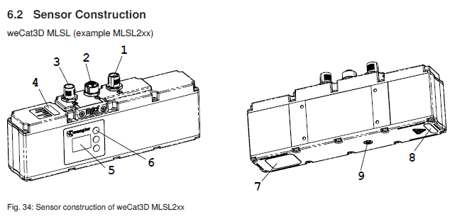

*Figura 17 - Sensor Wenglor MLSL246S40.*


*Figura 18 - Conectores do sensor Wenglor MLSL246S40.*

O sensor possui três conectores principais:

| Conector | Tipo | Observação |
|----------|------|------------|
| Conector 1 | M12, 12 pinos | O cabo deve ser fêmea |
| Conector 2 | M12, D-code | Comunicação Profinet |
| Conector 3 | M12, 8 pinos | O cabo deve ser macho |

## Conector 1 - Alimentação

O conector 1 é utilizado para alimentação do sensor.

| Pino | Sinal |
|------|-------|
| 1 | +18...30 VDC |
| 2 | 0 VDC |

## Conector 2 - Profinet

O conector 2 é utilizado para comunicação Profinet.

Utilize um cabo M12 D-code com conector RJ45 na outra extremidade.

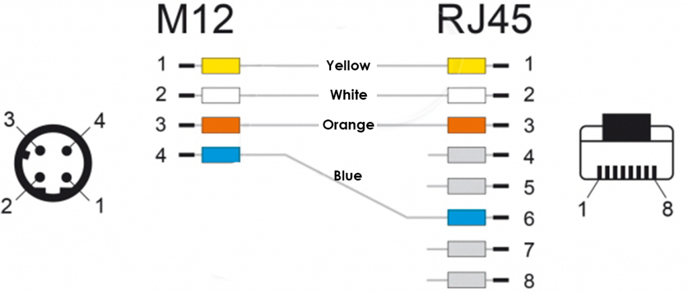

*Figura 19 - Conector M12 D-code utilizado para comunicação Profinet.*

## Conector 3 - Entradas digitais

O conector 3 é utilizado para as entradas digitais do sensor.

| Pino | Sinal | Ligação |
|------|-------|---------|
| 1 | +18...30 VDC | Alimentação positiva |
| 2 | E1 | Conectar na alimentação positiva |
| 3 | 0 V | Alimentação negativa |
| 8 | E2 | Conectar na alimentação positiva |

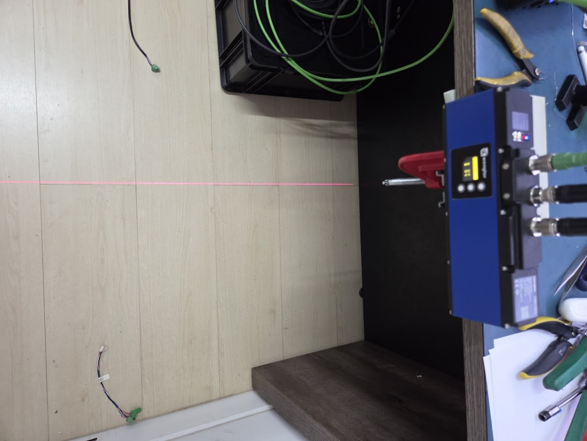

*Figura 20 - Conector M12 de 8 pinos do sensor Wenglor.*

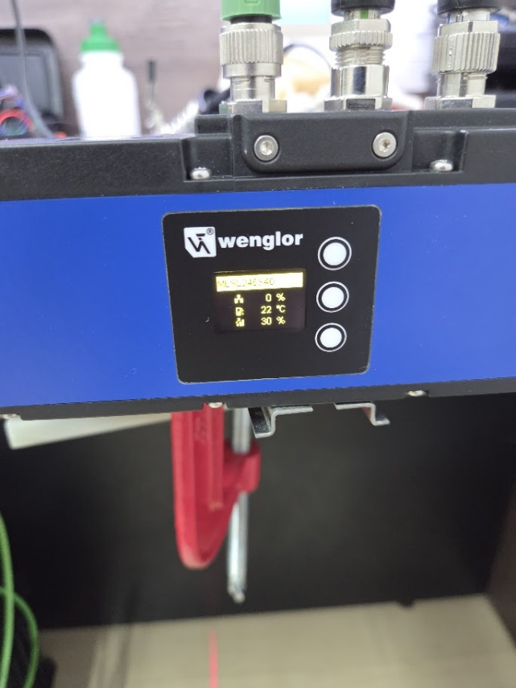

*Figura 21 - Cabo M12 utilizado no sensor Wenglor.*

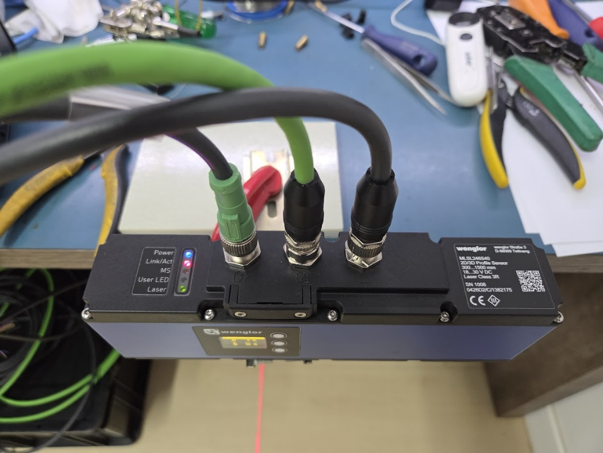

*Figura 22 - Exemplo de ligação do sensor Wenglor.*

## Computador industrial Coslitech

As figuras a seguir mostram o computador industrial Coslitech utilizado no HR1500.

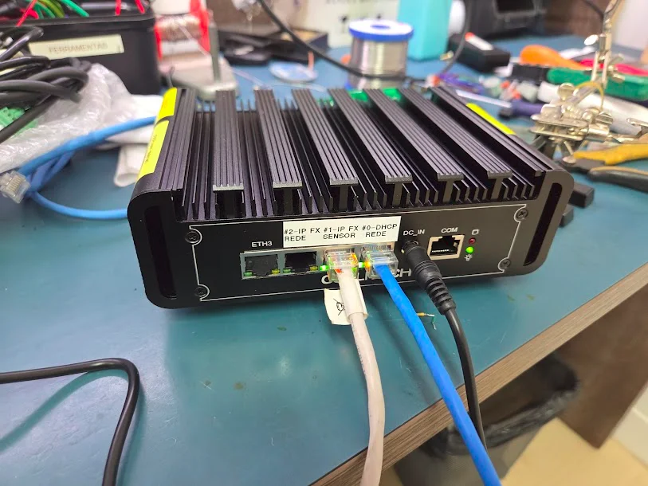

*Figura 23 - Computador industrial Coslitech.*

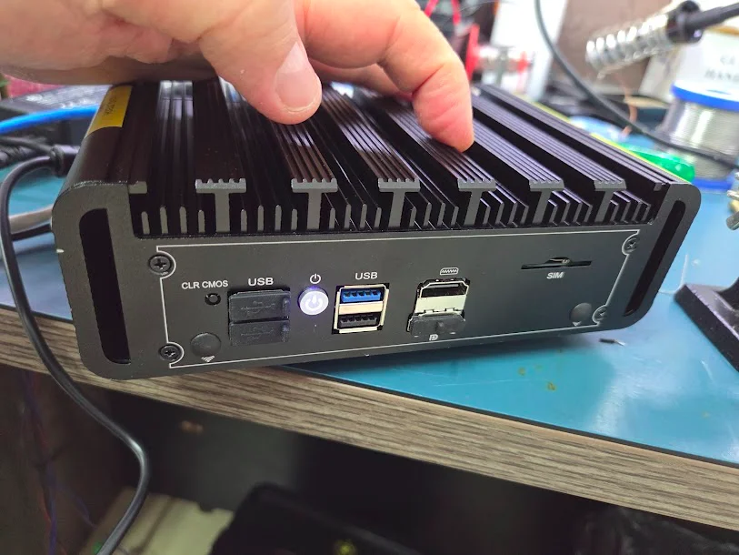

*Figura 24 - Portas do computador industrial Coslitech.*

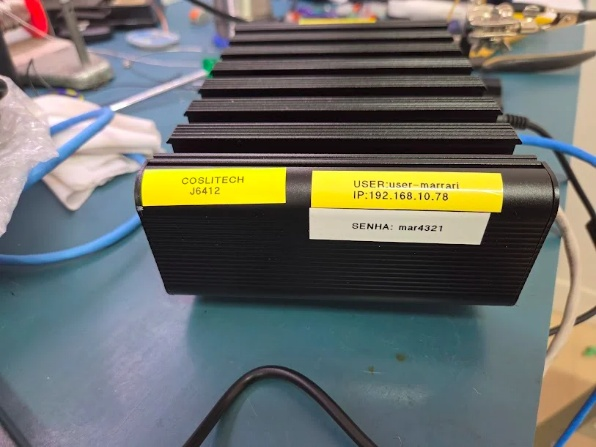

*Figura 25 - Detalhe do computador industrial Coslitech.*

## Console serial RS232

O computador industrial pode ser acessado sem monitor e sem teclado através da porta serial RS232 onboard.

Esse acesso é utilizado para operar o Linux em modo headless por meio de outro computador executando um terminal serial.

### Cabo serial

Utilize um cabo RS232 com conector DB9 em uma extremidade e RJ45 na outra.

| DB9 | RJ45 | Sinal |
|-----|------|-------|
| 2 | 6 | RXD |
| 3 | 3 | TXD |
| 5 | 5 | GND |

Conecte o lado RJ45 na porta serial do PC Coslitech J6412.

Conecte o lado DB9 em um conversor USB-RS232 ligado ao computador de manutenção.

No computador de manutenção, abra o terminal Minicom para comandar o Linux via console serial.

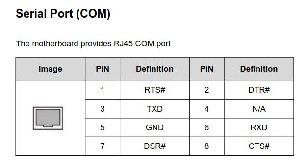

*Figura 26 - Ligação do console serial RS232 no PC Coslitech.*

## Conexão e configuração do sensor Wenglor

A figura abaixo apresenta uma visão geral ilustrativa da topologia do sistema.

> A imagem é apenas ilustrativa. Desconsidere o detalhamento técnico da figura.

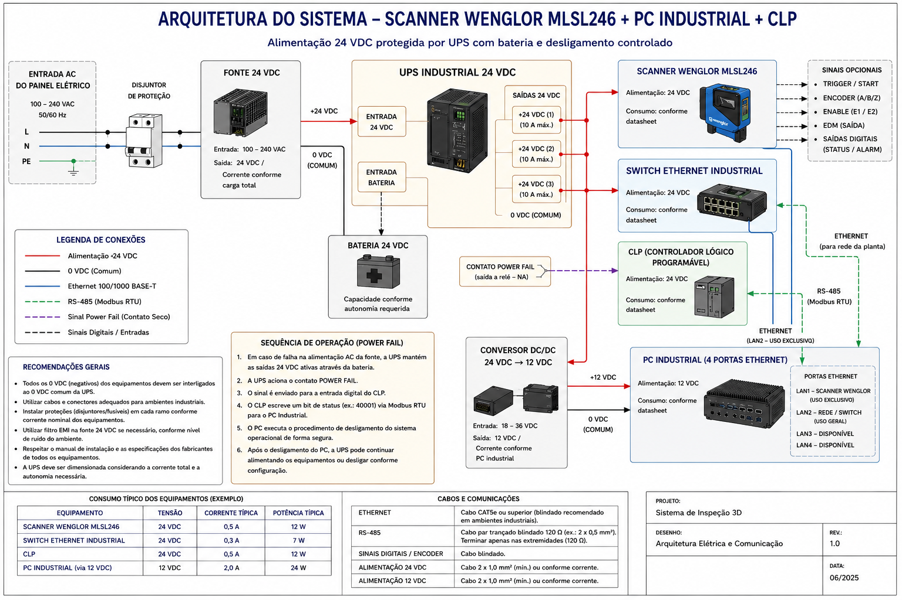

*Figura 27 - Topologia ilustrativa do sistema HR1500.*

## Esquemático de ligação do HR1500

O esquema abaixo apresenta as ligações principais do HR1500 usando a identificação dos equipamentos, interfaces e redes.

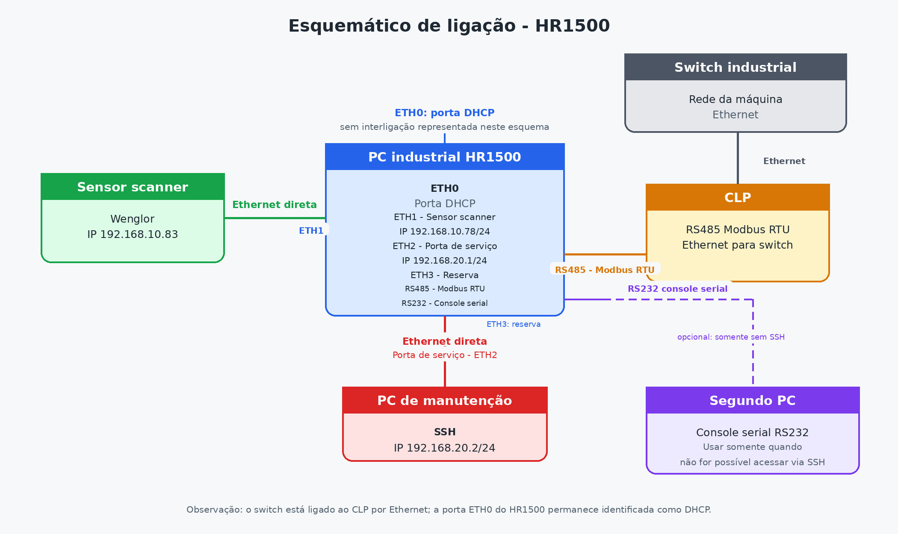

*Figura 28 - Esquemático de ligação do sistema HR1500.*

Resumo das conexões:

| Equipamento | Interface | Ligação | Configuração |
|-------------|-----------|---------|--------------|
| PC industrial HR1500 | `enp1s0` | Porta DHCP da rede da máquina | DHCP |
| PC industrial HR1500 | `enp2s0` | Sensor scanner Wenglor | `192.168.10.78/24` |
| Sensor scanner Wenglor | Ethernet / Profinet | Direto no PC industrial | `192.168.10.83` |
| PC industrial HR1500 | `enp3s0` | Porta de serviço para PC de manutenção | `192.168.20.1/24` |
| PC industrial HR1500 | RS485 | CLP | Modbus RTU |
| CLP | Ethernet | Switch industrial | Rede da máquina |

## Configuração do endereço IP do sensor

Após conectar os cabos do sensor, ligue o equipamento e configure o endereço IP pela IHM incorporada ao sensor.

No menu do sensor:

1. Navegue até encontrar o menu **Interface**.
2. Pressione o botão central.
3. Configure o endereço IP.
4. Configure a máscara de rede.
5. Configure o gateway, quando aplicável.

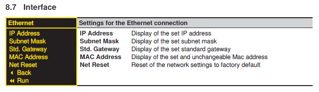

*Figura 29 - Menu Interface utilizado para configurar a rede do sensor.*

Configure o sensor com o seguinte endereço IP:

| Campo | Valor |
|-------|-------|
| Endereço IP | `192.168.10.83` |

Caso um segundo computador esteja conectado à mesma rede do sensor, o acesso também pode ser feito por navegador.

Para acessar a interface do sensor, digite o endereço IP no browser:

```text
http://192.168.10.83
```

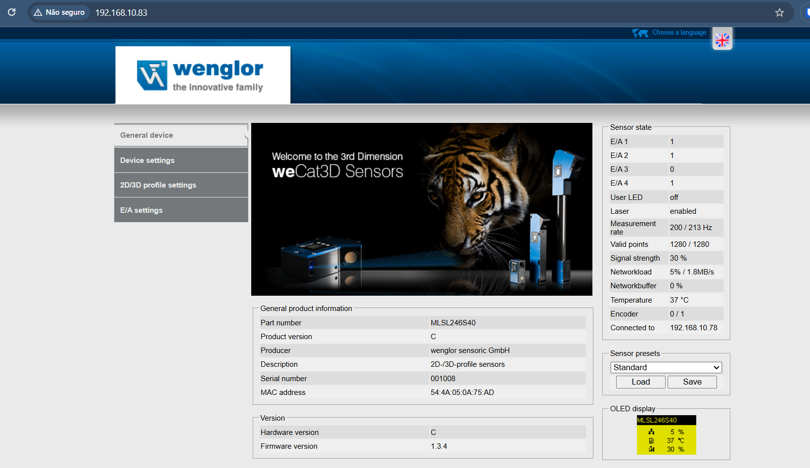

*Figura 30 - Acesso ao sensor Wenglor via navegador.*

## Conexão de rede do HR1500

Conecte o sensor Wenglor diretamente na interface `enp2s0` do computador industrial.

Essa interface corresponde à porta Ethernet dedicada ao sensor scanner e deve estar identificada por etiqueta.

A interface `enp2s0` utiliza endereço IP fixo na mesma faixa de rede do sensor:

```text
192.168.10.78/24
```

Conecte o computador industrial ao switch industrial pela interface `enp1s0`.

Essa interface corresponde à porta Ethernet da rede da máquina e também deve estar identificada por etiqueta.

A interface `enp1s0` é configurada para receber endereço IP por DHCP.

A porta de serviço utiliza a interface `enp3s0` com IP fixo:

```text
192.168.20.1/24
```

Utilize essa porta para conexão direta com o PC de manutenção.

A comunicação com o CLP é realizada pela interface RS485 utilizando Modbus RTU.
